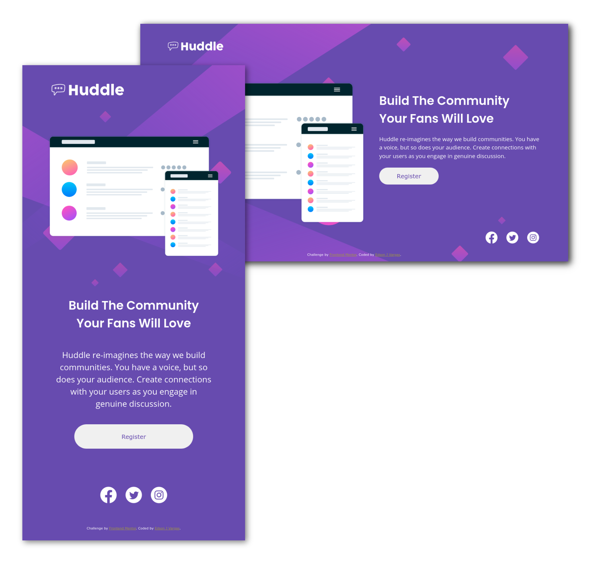

# Frontend Mentor - Huddle landing page with single introductory section solution

This is a solution to the [Huddle landing page with single introductory section challenge on Frontend Mentor](https://www.frontendmentor.io/challenges/huddle-landing-page-with-a-single-introductory-section-B_2Wvxgi0). Frontend Mentor challenges help you improve your coding skills by building realistic projects. 

## Table of contents

- [Overview](#overview)
  - [The challenge](#the-challenge)
  - [Screenshot](#screenshot)
  - [Links](#links)
- [My process](#my-process)
  - [Built with](#built-with)
  - [What I learned](#what-i-learned)
  - [Continued development](#continued-development)
  - [Useful resources](#useful-resources)
- [Author](#author)
- [Acknowledgments](#acknowledgments)

**Note: Delete this note and update the table of contents based on what sections you keep.**

## Overview

### The challenge

Users should be able to:

- View the optimal layout for the page depending on their device's screen size
- See hover states for all interactive elements on the page

### Screenshot

### Links

- [Solution URL](https://www.frontendmentor.io/solutions/reactjs-solution-scss-bootstrap-rscss-progressive-enhancement-JactSnj13)
- [Live site URL](https://edsonv.github.io/Huddle-landing-page-with-single-introductory-section/)

## My process

### Built with

- Semantic HTML markup
- Dart SCSS
- Bootstrap
- Flexbox
- Mobile-first workflow - Progressive Enhancement
- [React](https://reactjs.org/) - JS library
- [RSCSS](https://rscss.io/) - For styles

### What I learned

Bootstrap has been very useful to set up the starting layout and after that, custom styles and measurements applied to the original design were needed to stick close enough it.

The semantic tags were wrapped inside div tags with `.row` and `.col` classes.

### Continued development

I would like to improve layout concepts and reinforce the use of semantic tags while using RSCSS system to style the components.

## Author

- Frontend Mentor - [@edsonv](https://www.frontendmentor.io/profile/edsonv)
- Telegram - [@edsonv](https://t.me/edsonv)
